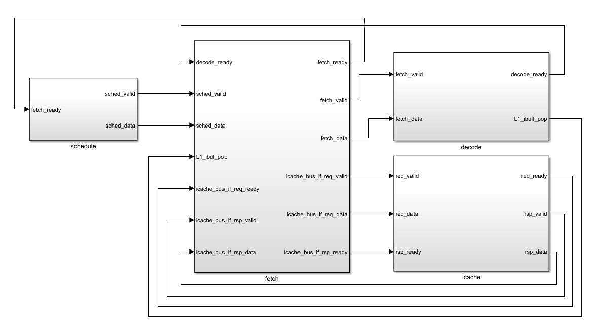

# Fetch Stage

## Overview

The fetch stage retrieves instructions from the instruction cache and buffers the program counter and thread mask while issuing cache requests. It ensures proper alignment of instructions with their respective warps and threads.



## Interfaces

| Interface Name         | Description                                    |
|------------------------|------------------------------------------------|
| [`schedule_if`](https://github.com/RISC-V-Based-Accelerators/vortex/blob/master/hw/rtl/interfaces/VX_schedule_if.sv)          | Slave interface for [VX_elastic_buffer](https://github.com/RISC-V-Based-Accelerators/vortex/blob/ce1396346e2f69a569352fda6f490dd7dad13056/hw/rtl/core/VX_schedule.sv#L350) in schedule stage           |
| [`icache_bus_if`](https://github.com/RISC-V-Based-Accelerators/vortex/blob/master/hw/rtl/mem/VX_mem_bus_if.sv)        | Master interface for interacting with icache through [VX_elastic_buffer](https://github.com/RISC-V-Based-Accelerators/vortex/blob/ce1396346e2f69a569352fda6f490dd7dad13056/hw/rtl/core/VX_fetch.sv#L104) |
| [`fetch_if`](https://github.com/RISC-V-Based-Accelerators/vortex/blob/master/hw/rtl/interfaces/VX_fetch_if.sv)             | Master interface for [VX_elastic_buffer](https://github.com/RISC-V-Based-Accelerators/vortex/blob/ce1396346e2f69a569352fda6f490dd7dad13056/hw/rtl/core/VX_decode.sv#L542) in decode stage        |

### Schedule Interface

| Port Name    | Width                  | Direction | Description                          |
|--------------|------------------------|-----------|--------------------------------------|
| `data.uuid`  | `[UUID_WIDTH-1:0]`     | Input     | Universal Unique ID                  |
| `data.wid`   | `[NW_WIDTH-1:0]`       | Input     | Warp ID                              |
| `data.tmask` | `[NUM_THREADS:0]`      | Input     | Thread mask                          |
| `data.pc`    | `[PC_BITS-1:0]`        | Input     | Program counter                      |
| `valid`      | `1 bit`                | Input     | Schedule data is valid               |
| `ready`      | `1 bit`                | Output    | Fetch stage is ready to receive data |

### Icache Bus Interface

| Port              | Size                  | Direction     | Description                                                                |
|-------------------|-----------------------|---------------|----------------------------------------------------------------------------|
| `req_data.rw`     | 1 bit                 | Output        | 0 for read, 1 for write request                                            |
| `req_data.addr`   | `[ADDR_WIDTH-1:0]`    | Output        | Memory access address of the operation                                     |
| `req_data.data`   | `[DATA_SIZE*8-1:0]`   | Output        | Data to be written to memory in case of a write operation (`rw=1`)         |
| `req_data.byteen` | `[DATA_SIZE-1:0]`     | Output        | Byte enable                                                                |
| `req_data.flags`  | `[FLAGS_WIDTH-1:0]`   | Output        | Flags for additional request attributes                                    |
| `req_data.tag`    | `[TAG_WIDTH-1:0]`     | Output        | Unique identifier for the request. Helps match responses to requests       |
| `rsp_data.data`   | `[DATA_SIZE*8-1:0]`   | Input         | Data read from memory in response to a read request                        |
| `rsp_data.tag`    | `[TAG_WIDTH-1:0]`     | Input         | Matches the tag field of the corresponding request                         |
| `req_valid`       | 1 bit                 | Output        | Asserted by fetch module to indicate a valid memory request                |
| `req_ready`       | 1 bit                 | Input         | Indicates memory controller is ready to accept a request                   |
| `rsp_valid`       | 1 bit                 | Input         | Indicates a valid response is available from the memory controller         |
| `rsp_ready`       | 1 bit                 | Output        | Asserted by fetch module to indicate it is ready to accept a response      |

### Fetch Interface

| Port Name    | Width                   | Direction | Description                                                   |
|--------------|-------------------------|-----------|---------------------------------------------------------------|
| `data.uuid`  | `[UUID_WIDTH-1:0]`      | Output    | Universal Unique ID                                           |
| `data.wid`   | `[NW_WIDTH-1:0]`        | Output    | Warp ID                                                       |
| `data.tmask` | `[NUM_THREADS:0]`       | Output    | Thread mask                                                   |
| `data.pc`    | `[PC_BITS-1:0]`         | Output    | Program counter                                               |
|`data.instr`  | `[31:0]`                | Output    | Fetched instruction                                           |
| `valid`      | `1 bit`                 | Input     | Fetch data is valid                                           |
| `ready`      | `1 bit`                 | Input     | Decode stage is ready to receive data                         |
|`Ibuf_pop`    | `1 bit`                 | Input     | [Signal](https://github.com/RISC-V-Based-Accelerators/vortex/blob/ce1396346e2f69a569352fda6f490dd7dad13056/hw/rtl/interfaces/VX_decode_if.sv#L57) from decode stage indicating that instruction buffer has popped an entry [Only when `L1_ENABLE` is set]|

## Modules

### VX_elastic_buffer

```verilog
    assign req_tag = schedule_if.data.wid;
    assign icache_req_valid = schedule_if.valid && ibuf_ready;
    assign icache_req_addr  = schedule_if.data.PC[1 +: ICACHE_ADDR_WIDTH];
    assign icache_req_tag   = {schedule_if.data.uuid, req_tag};
    assign schedule_if.ready = icache_req_ready && ibuf_ready;

    VX_elastic_buffer #(
        .DATAW   (ICACHE_ADDR_WIDTH + ICACHE_TAG_WIDTH),
        .SIZE    (2),
        .OUT_REG (1) // external bus should be registered
    ) req_buf (
        .clk       (clk),
        .reset     (reset),
        .valid_in  (icache_req_valid),
        .ready_in  (icache_req_ready),
        .data_in   ({icache_req_addr, icache_req_tag}),
        .data_out  ({icache_bus_if.req_data.addr, icache_bus_if.req_data.tag}),
        .valid_out (icache_bus_if.req_valid),
        .ready_out (icache_bus_if.req_ready)
    );
```

A streaming buffer module is instatiated to buffer icache requests:

- **`valid_in`**: Input data is only valid when the schedule data is valid and ibuffer is not full.
- **`data_in`**: {Address to be fetched (PC), UUID, Warp ID}.
- **`ready_in`**: Icache is ready to receive new requests.
- The output signals (`data_out`, `valid_out`, `ready_out`) are input to the icache.

```verilog
    assign icache_bus_if.req_data.flags  = '0;
    assign icache_bus_if.req_data.rw     = 0;
    assign icache_bus_if.req_data.byteen = '1;
    assign icache_bus_if.req_data.data   = '0;
```

- **`req_data.flags`**: No special flags are needed.
- **`req_data.rw`**: Read operation only.
- **`req_data.byteen`**: All bytes of the memory word are enabled for access.
- **`req_data.data`**: We are not writing to the memory.

### VX_dp_ram

```verilog
    wire icache_req_fire = icache_req_valid && icache_req_ready;

    VX_dp_ram #(
        .DATAW  (`PC_BITS + `NUM_THREADS),
        .SIZE   (`NUM_WARPS),
        .LUTRAM (1)
    ) tag_store (
        .clk   (clk),
        .reset (reset),
        .read  (1'b1),
        .write (icache_req_fire),
        .wren  (1'b1),
        .waddr (req_tag),
        .wdata ({schedule_if.data.PC, schedule_if.data.tmask}),
        .raddr (rsp_tag),
        .rdata ({rsp_PC, rsp_tmask})
    );
```

A dual-port RAM is instantiated to write into (when issuing a request) and read from (when icache responds) the PC & thread mask of each requested warp.

- **`write`**: Asserted when data is valid from schedule stage and the icache is ready for new requests.
- **`waddr`**: The write address is the requested warp ID (`assign req_tag = schedule_if.data.wid;`).
- **`wdata`**: PC and thread mask from schedule stage.
- **`raddr`**: The read address is the warp ID from the response (`assign {rsp_uuid, rsp_tag} = icache_bus_if.rsp_data.tag;`).
- **`rdata`**: PC and thread mask to be sent to decode stage.

### VX_pending_size (Optional: Only when L1 cache is enabled)

```verilog
`ifndef L1_ENABLE
    wire [`NUM_WARPS-1:0] pending_ibuf_full;
    for (genvar i = 0; i < `NUM_WARPS; ++i) begin : g_pending_reads
        VX_pending_size #(
            .SIZE (`IBUF_SIZE)
        ) pending_reads (
            .clk   (clk),
            .reset (reset),
            .incr  (icache_req_fire && schedule_if.data.wid == i),
            .decr  (fetch_if.ibuf_pop[i]),
            .full  (pending_ibuf_full[i])
        );
    end
    wire ibuf_ready = ~pending_ibuf_full[schedule_if.data.wid];
`else
    wire ibuf_ready = 1'b1;
`endif
```

This module monitors the size of the instruction buffer (ibuffer) to prevent deadlocks caused by memory contention between the instruction and data caches.

- **`pending_ibuf_full`**: Tracks whether the ibuffer for each warp is full.
- **`incr`**: Incremented when a fetch request for the specific warp is fired.
- **`decr`**: Decremented when an instruction is popped from the ibuffer.
- **`ibuf_ready`**: Indicates whether the instruction buffer for the requested warp can accept new data. If L1 cache is enabled, `ibuf_ready` is always `1'b1`.
