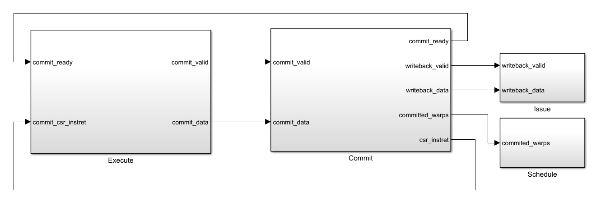

# VX_commit

## Parameters

| Parameter      | Default Value                        | Description                                                                 |
|----------------|--------------------------------------|-----------------------------------------------------------------------------|
| [`UUID_WIDTH`](https://github.com/vortexgpgpu/vortex/blob/01974e124f114489844f148c43db00fe14e187ae/hw/rtl/VX_define.vh#L52)   | 44 bits (default) or 1 bit (if neither `NDEBUG` nor `SCOPE` is defined) | Width of the Universal Unique ID, configurable based on debug/scoping mode.|
| `XLEN`                 | Architecture-defined (e.g., 32, 64) | Width of general-purpose registers and native integer data types in RISC-V.|
| [`PC_BITS`](https://github.com/vortexgpgpu/vortex/blob/01974e124f114489844f148c43db00fe14e187ae/hw/rtl/VX_define.vh#L64)              | `XLEN - 1`                          | Width of the program counter (depends on XLEN).                            |
| [`NUM_EX_UNITS`](https://github.com/vortexgpgpu/vortex/blob/01974e124f114489844f148c43db00fe14e187ae/hw/rtl/VX_define.vh#L77)         | `3 + EXT_F_ENABLE`                  | Number of execution units, including floating-point if enabled.            |
| [`EX_BITS`](https://github.com/vortexgpgpu/vortex/blob/01974e124f114489844f148c43db00fe14e187ae/hw/rtl/VX_define.vh#L78)              | `CLOG2(NUM_EX_UNITS)`               | Number of bits required to encode execution unit selection.                |
| [`ISSUE_WIDTH`](https://github.com/vortexgpgpu/vortex/blob/01974e124f114489844f148c43db00fe14e187ae/hw/rtl/VX_config.vh#L352)          | `UP(NUM_WARPS / 8)`                 | Number of instructions issued per cycle, dependent on warp configuration.  |
| [`NR_BITS`](https://github.com/vortexgpgpu/vortex/blob/main/hw/rtl/VX_define.vh#L45)      | `CLOG2(NUM_REGS)`                   | Number of bits required to address all registers.                          |
| [`NW_BITS`](https://github.com/vortexgpgpu/vortex/blob/01974e124f114489844f148c43db00fe14e187ae/hw/rtl/VX_define.vh#L27)      | `UP(CLOG2(NUM_WARPS))`                   | Number of bits required to address all warps.                          |
| `COMMIT_SIZEW` | `CLOG2(NUM_THREADS + 1)` | |
| `COMMIT_ALL_SIZEW` | `CLOG2(NUM_THREADS + 1)` | |

## Interfaces and Ports



### Commit Interface

| Port Name      | Width                     | Direction | Description                                      |
|----------------|---------------------------|-----------|--------------------------------------------------|
| `valid`        | 1 bit                     | Input     | Indicates if the instruction is valid.          |
| `ready`        | 1 bit                     | Output    | Indicates readiness to receive an instruction.  |
| `data.uuid`    | `UUID_WIDTH`              | Input     | Universal Unique ID for the instruction.        |
| `data.wid`     | `NW_WIDTH`                | Input     | Warp ID of the instruction.                     |
| `data.tmask`   | `NUM_LANES`               | Input     | Thread mask indicating active threads.          |
| `data.PC`      | `PC_BITS`                 | Input     | Program counter value.                          |
| `data.wb`      | 1 bit                     | Input     | Indicates if writeback is required.             |
| `data.rd`      | `NR_BITS`                 | Input     | Destination register.                           |
| `data.data`    | `NUM_LANES x XLEN`        | Input     | Writeback data for active threads.              |
| `data.pid`     | `PID_WIDTH`               | Input     | Pipeline ID for the instruction.                |
| `data.sop`     | 1 bit                     | Input     | Start of packet flag.                           |
| `data.eop`     | 1 bit                     | Input     | End of packet flag.                             |

### Writeback Interface

| Port Name      | Width                     | Direction | Description                                      |
|----------------|---------------------------|-----------|--------------------------------------------------|
| `valid`        | 1 bit                     | Output    | Indicates if the writeback data is valid.       |
| `data.uuid`    | `UUID_WIDTH`              | Output    | Universal Unique ID for the instruction.        |
| `data.wis`     | `ISSUE_WIS_W`             | Output    | Warp Issue Slot ID for the instruction.         |
| `data.tmask`   | `NUM_THREADS`             | Output    | Thread mask indicating active threads.          |
| `data.PC`      | `PC_BITS`                 | Output    | Program counter value.                          |
| `data.rd`      | `NR_BITS`                 | Output    | Destination register.                           |
| `data.data`    | `NUM_THREADS x XLEN`      | Output    | Writeback data for active threads.              |
| `data.sop`     | 1 bit                     | Output    | Start of packet flag.                           |
| `data.eop`     | 1 bit                     | Output    | End of packet flag.                             |

### CSR Interface

| Port Name | Width               | Direction | Description                                    |
|-----------|---------------------|-----------|------------------------------------------------|
| `instret` | `PERF_CTR_BITS`     | Output    | Performance counter indicating the number of retired instructions. |

### Schedule Interface

| Port Name           | Width          | Direction | Description                                            |
|---------------------|----------------|-----------|--------------------------------------------------------|
| `committed_warps`   | `NUM_WARPS`    | Output    | Indicates which warps have completed and committed execution. |

## Code

```verilog
VX_commit_if commit_arb_if[`ISSUE_WIDTH]();

wire [`ISSUE_WIDTH-1:0] per_issue_commit_fire;
wire [`ISSUE_WIDTH-1:0][`NW_WIDTH-1:0] per_issue_commit_wid;
wire [`ISSUE_WIDTH-1:0][`NUM_THREADS-1:0] per_issue_commit_tmask;
wire [`ISSUE_WIDTH-1:0] per_issue_commit_eop;

for (genvar i = 0; i < `ISSUE_WIDTH; ++i) begin : g_commit_arbs

   wire [`NUM_EX_UNITS-1:0]            valid_in;
   wire [`NUM_EX_UNITS-1:0][DATAW-1:0] data_in;
   wire [`NUM_EX_UNITS-1:0]            ready_in;

   for (genvar j = 0; j < `NUM_EX_UNITS; ++j) begin : g_data_in
      assign valid_in[j] = commit_if[j * `ISSUE_WIDTH + i].valid;
      assign data_in[j]  = commit_if[j * `ISSUE_WIDTH + i].data;
      assign commit_if[j * `ISSUE_WIDTH + i].ready = ready_in[j];
   end

   VX_stream_arb #(
      .NUM_INPUTS (`NUM_EX_UNITS),
      .DATAW      (DATAW),
      .ARBITER    ("P"),
      .OUT_BUF    (1)
   ) commit_arb (
      .clk        (clk),
      .reset      (reset),
      .valid_in   (valid_in),
      .ready_in   (ready_in),
      .data_in    (data_in),
      .data_out   (commit_arb_if[i].data),
      .valid_out  (commit_arb_if[i].valid),
      .ready_out  (commit_arb_if[i].ready),
      `UNUSED_PIN (sel_out)
   );
end
```

- For each issue slice, an array of commit interfaces (`commit_arb_if`) is instantiated, with each interface handling the valid, ready, and data signals from multiple execution units in the slice.
  
- A priority arbiter (`VX_stream_arb`) is instantiated for each slice, selecting the valid and ready execution unit's data, ensuring arbitration between execution units within the slice.

```verilog
wire [`ISSUE_WIDTH-1:0] per_issue_commit_fire;
wire [`ISSUE_WIDTH-1:0][`NW_WIDTH-1:0] per_issue_commit_wid;
wire [`ISSUE_WIDTH-1:0][`NUM_THREADS-1:0] per_issue_commit_tmask;
wire [`ISSUE_WIDTH-1:0] per_issue_commit_eop;

for (genvar i = 0; i < `ISSUE_WIDTH; ++i) begin : 
   assign per_issue_commit_fire[i] = commit_arb_if[i].valid && commit_arb_if[i].ready;
   assign per_issue_commit_tmask[i]= {`NUM_THREADS{per_issue_commit_fire[i]}} & commit_arb_if[i].data.tmask;
   assign per_issue_commit_wid[i]  = commit_arb_if[i].data.wid;
   assign per_issue_commit_eop[i]  = commit_arb_if[i].data.eop;
end
```

The thread mask is AND-ed with the `per_issue_commit_fire` signal to ensure that it is only set when the arbiter is ready and its data is valid.

```verilog
assign commit_fire_any = (| per_issue_commit_fire);
```

The signal `commit_fire_any` indicates whether any slice has a valid commit.

```verilog
`POP_COUNT(count, per_issue_commit_tmask[i]);
assign commit_size[i] = count;
```

The resulting `commit_size` array contains the number of committed threads for each slice.

```verilog
VX_pipe_register #(
   .DATAW  (1 + `ISSUE_WIDTH * COMMIT_SIZEW),
   .RESETW (1)
) commit_size_reg1 (
   .clk      (clk),
   .reset    (reset),
   .enable   (1'b1),
   .data_in  ({commit_fire_any, commit_size}),
   .data_out ({commit_fire_any_r, commit_size_r})
);
```

- **Input (`data_in`)**: Includes `commit_fire_any` and the entire `commit_size` array.
- **Output (`data_out`)**: The same signals (`commit_fire_any_r` and `commit_size_r`) delayed by one clock cycle.

```verilog
VX_reduce #(
   .DATAW_IN (COMMIT_SIZEW),
   .DATAW_OUT (COMMIT_ALL_SIZEW),
   .N  (`ISSUE_WIDTH),
   .OP ("+")
) commit_size_reduce (
   .data_in  (commit_size_r),
   .data_out (commit_size_all_r)
);
```

- A `VX_reduce` module is used to compute the total number of committed threads across all slices (`commit_size_all_r`):
- **Input (`data_in`)**: The delayed `commit_size_r` array.
- **Output (`data_out`)**: The aggregated commit size (`commit_size_all_r`), computed as the sum of all `commit_size_r` values using addition (`OP = "+"`).

```verilog
VX_pipe_register #(
   .DATAW  (1 + COMMIT_ALL_SIZEW),
   .RESETW (1)
) commit_size_reg2 (
   .clk      (clk),
   .reset    (reset),
   .enable   (1'b1),
   .data_in  ({commit_fire_any_r, commit_size_all_r}),
   .data_out ({commit_fire_any_rr, commit_size_all_rr})
);
```

- The aggregated commit size and delayed `commit_fire_any` are stored in a second pipeline register (`commit_size_reg2`):
- **Input (`data_in`)**: Includes the delayed `commit_fire_any_r` and the aggregated commit size (`commit_size_all_r`).
- **Output (`data_out`)**: Delays these signals by another clock cycle (`commit_fire_any_rr` and `commit_size_all_rr`).

```verilog
reg [`PERF_CTR_BITS-1:0] instret;
always @(posedge clk) begin
   if (reset) begin
         instret <= '0;
   end else begin
         if (commit_fire_any_rr) begin
            instret <= instret + `PERF_CTR_BITS'(commit_size_all_rr);
         end
   end
end
```
  
- A performance counter (`instret`) keeps track of the total number of instructions retired (committed):
- **Reset**: When `reset` is asserted, `instret` is cleared.
- **Update**: On each cycle, if `commit_fire_any_rr` is asserted (indicating a valid commit):
- `instret` is incremented by the total number of committed threads (`commit_size_all_rr`).

```verilog
assign commit_csr_if.instret = instret;
```

The `instret` counter value is exposed to the control and status register (CSR) interface for tracking purposes.

```verilog
// Track committed instructions

reg [`NUM_WARPS-1:0] committed_warps;

always @(*) begin
   committed_warps = 0;
   for (integer i = 0; i < `ISSUE_WIDTH; ++i) begin
      if (per_issue_commit_fire[i] && per_issue_commit_eop[i]) begin
            committed_warps[per_issue_commit_wid[i]] = 1;
      end
   end
end

VX_pipe_register #(
   .DATAW  (`NUM_WARPS),
   .RESETW (`NUM_WARPS)
) committed_pipe_reg (
   .clk      (clk),
   .reset    (reset),
   .enable   (1'b1),
   .data_in  (committed_warps),
   .data_out ({commit_sched_if.committed_warps})
);
```

For each issue slice, `committed_warps` is updated using `per_issue_commit_fire` and is then sent to the schedule stage.

```verilog
// Writeback

for (genvar i = 0; i < `ISSUE_WIDTH; ++i) begin : g_writeback
   assign writeback_if[i].valid     = commit_arb_if[i].valid && commit_arb_if[i].data.wb;
   assign writeback_if[i].data.uuid = commit_arb_if[i].data.uuid;
   assign writeback_if[i].data.wis  = wid_to_wis(commit_arb_if[i].data.wid);
   assign writeback_if[i].data.PC   = commit_arb_if[i].data.PC;
   assign writeback_if[i].data.tmask= commit_arb_if[i].data.tmask;
   assign writeback_if[i].data.rd   = commit_arb_if[i].data.rd;
   assign writeback_if[i].data.data = commit_arb_if[i].data.data;
   assign writeback_if[i].data.sop  = commit_arb_if[i].data.sop;
   assign writeback_if[i].data.eop  = commit_arb_if[i].data.eop;
   assign commit_arb_if[i].ready = 1'b1; // writeback has no backpressure
end
```

Finally, the data is written back in the register file in the issue stage for each issue slice.
