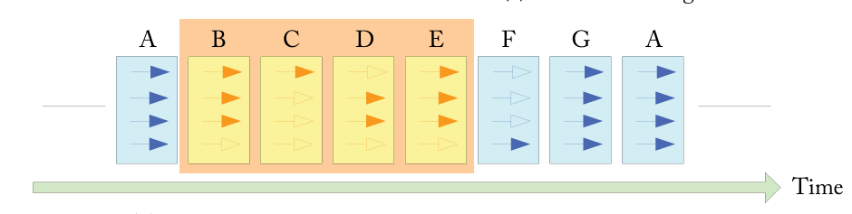
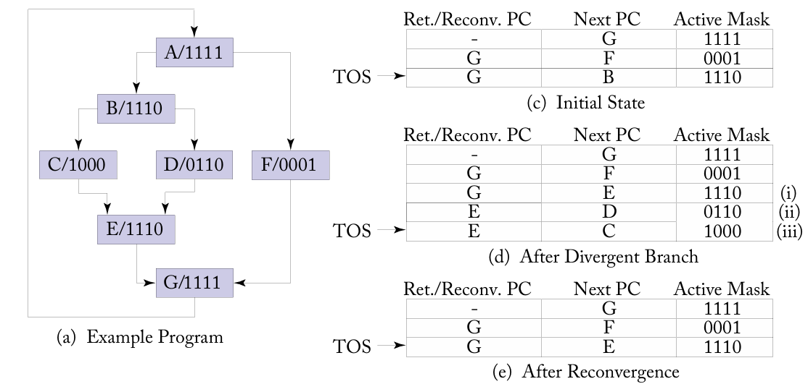

# Schedule Stage

## Overview

The **Schedule Stage** is the initial stage in the pipeline, playing a pivotal role in the execution of warps. It ensures the smooth progression of instructions through the pipeline by carefully selecting and managing warps.

### Responsibilities

1. **Warp Selection**:  
   Chooses a warp to propagate to subsequent stages in the pipeline, prioritizing based on specific criteria such as readiness and resource availability.

2. **Warp Mask Management**:  
   Updates the warp masks to reflect active threads. This includes applying changes resulting from branch divergence or synchronization events.

3. **Program Counter (PC) Updates**:  
   Adjusts the program counters (PC) of warps to point to the correct instruction for execution, ensuring accurate control flow.

4. **Stall Handling**:  
   Identifies and resolves stalls by unlocking warps that were previously blocked due to resource conflicts, dependencies, or other pipeline constraints.

## Interfaces

### Warp Control Unit

Modern GPUs employ the Single-Instruction Multiple-Thread (SIMT) execution model to provide the illusion of independent thread execution while maintaining the performance benefits of SIMD hardware. A critical component enabling this abstraction is the warp control unit, which is located in the Special Function Unit (SFU) in the execute stage, and it handles the GPU custom instructions.

#### Branch Divergence & Reconvergence

Recall that each warp has 32 threads moving in a lockstep executing the same instruction. However, **Branch Divergence** happens when there is a condition on a certain thread within a warp so that each thread can follow different execution paths.  The approach used is to serialize execution of threads following different paths within a given warp as shown below.



To achieve this serialization of divergent code paths, a **SIMT stack** is used.  Each entry on this stack contains three entries:

- A reconvergence program counter (RPC)
- The address of the next instruction to execute (Next PC)
- An active mask

The following example will help explain its operation.

```cpp
do {
    t1 = tid * N;        // A
    t2 = t1 + i;
    t3 = data1[t2];
    t4 = 0;

    if (t3 != t4) {
        t5 = data2[t2];  // B

        if (t5 != t4) {
            x += 1;      // C
        } else {
            y += 2;      // D
        }
    } else {
        z += 3;          // F
    }

    i++;  // G
} while (i < N);
```

- All threads move in lockstep during **Instruction `A`** with an **active mask = 1111**.  
- Upon encountering the first `if (t3 != t4)`:
  - A **split** instruction is executed.  
  - **Reconvergence point (`G`)** is pushed to the SIMT stack first.  
  - Divergent paths (`F` and `B`) are then pushed onto the stack.

- Upon encountering the second `if (t5 != t4)`:
  - Another **split** instruction is executed.  
  - **Reconvergence point (`E`)** is pushed to the stack first.  
  - Divergent paths (`D` and `C`) are then pushed onto the stack.  

- Upon reaching a reconvergence point:
  - A **join** instruction is encountered to **pop the stack entries**.  
  - The **active mask** of the reconvergence point must match the mask at the corresponding divergence point.  

- Note that:
  - Stack operates in **last-in, first-out (LIFO)** order.  
  - The path with more active threads is usually pushed last for efficiency.



#### Barriers