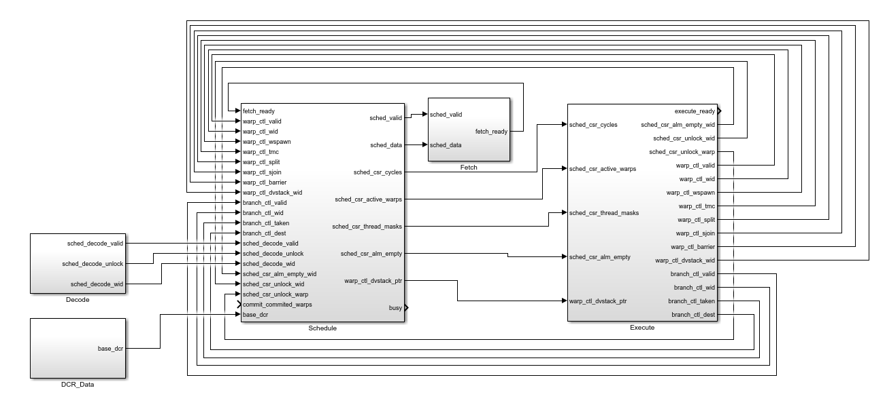

# Schedule Stage

## Parameters

| **Name**           | **Default Value**           | **Description**                                                  |
|--------------------|-----------------------------|------------------------------------------------------------------|
| [`NUM_WARPS`](https://github.com/vortexgpgpu/vortex/blob/01974e124f114489844f148c43db00fe14e187ae/hw/rtl/VX_config.vh#L101)        | 4          | Number of warps in the GPU.                                      |
| [`NUM_THREADS`](https://github.com/vortexgpgpu/vortex/blob/01974e124f114489844f148c43db00fe14e187ae/hw/rtl/VX_config.vh#L105)      | 4          | Number of threads per warp.                                      |
| [`PC_BITS`](https://github.com/vortexgpgpu/vortex/blob/01974e124f114489844f148c43db00fe14e187ae/hw/rtl/VX_define.vh#L64)              | `XLEN - 1`                          | Width of the program counter. |
| [`NW_WIDTH`](https://github.com/vortexgpgpu/vortex/blob/01974e124f114489844f148c43db00fe14e187ae/hw/rtl/VX_define.vh#L27)         | `UP(CLOG2(NUM_WARPS))`          | Bit width for warp IDs.                                          |
| [`UUID_WIDTH`](https://github.com/vortexgpgpu/vortex/blob/01974e124f114489844f148c43db00fe14e187ae/hw/rtl/VX_define.vh#L52)   | 44 bits (default) or 1 bit (if neither `NDEBUG` nor `SCOPE` is defined) | Width of the Universal Unique ID, configurable based on debug/scoping mode.|
| [`NUM_ALU_BLOCKS`](https://github.com/vortexgpgpu/vortex/blob/01974e124f114489844f148c43db00fe14e187ae/hw/rtl/VX_config.vh#L360)   | `UP(NUM_WARPS / 8)`          | Number of ALU blocks in the GPU.                                 |
| [`NUM_BARRIERS`](https://github.com/vortexgpgpu/vortex/blob/01974e124f114489844f148c43db00fe14e187ae/hw/rtl/VX_config.vh#L109)     | `UP(NUM_WARPS / 2)`           | Number of barriers.                         |
| [`NB_WIDTH`](https://github.com/vortexgpgpu/vortex/blob/01974e124f114489844f148c43db00fe14e187ae/hw/rtl/VX_define.vh#L33)         | `UP(CLOG2(NUM_BARRIERS))`           | Bit width for number of barriers.                        |
| [`NC_WIDTH`](https://github.com/vortexgpgpu/vortex/blob/01974e124f114489844f148c43db00fe14e187ae/hw/rtl/VX_define.vh#L24)         | `UP(CLOG2(NUM_WARPS))`           | Bit width for number of warps.                      |

## Interfaces & Ports



| Interface Name                     | Description                                                      |
|-------------------------------------|------------------------------------------------------------------|
| `base_dcrs`                       | Input configuration interface for base device control registers. |
| [`warp_ctl_if`](https://github.com/RISC-V-Based-Accelerators/vortex/blob/master/hw/rtl/interfaces/VX_warp_ctl_if.sv)                       | Slave interface for [VX_wctl_unit](https://github.com/RISC-V-Based-Accelerators/vortex/blob/ce1396346e2f69a569352fda6f490dd7dad13056/hw/rtl/core/VX_wctl_unit.sv#L16) in the [VX_sfu_unit](https://github.com/RISC-V-Based-Accelerators/vortex/blob/ce1396346e2f69a569352fda6f490dd7dad13056/hw/rtl/core/VX_sfu_unit.sv#L16) in the execute stage                |
| [`branch_ctl_if`](https://github.com/RISC-V-Based-Accelerators/vortex/blob/master/hw/rtl/interfaces/VX_branch_ctl_if.sv)                     | Slave interface for [alu_int](https://github.com/RISC-V-Based-Accelerators/vortex/blob/ce1396346e2f69a569352fda6f490dd7dad13056/hw/rtl/core/VX_alu_int.sv#L16) to handle branching signals |
| [`decode_sched_if`](https://github.com/RISC-V-Based-Accelerators/vortex/blob/master/hw/rtl/interfaces/VX_decode_sched_if.sv)                 | Slave interface for [decode](https://github.com/RISC-V-Based-Accelerators/vortex/blob/ce1396346e2f69a569352fda6f490dd7dad13056/hw/rtl/core/VX_decode.sv#L41) stage to unlock stalled warps           |
| [`commit_sched_if`](https://github.com/RISC-V-Based-Accelerators/vortex/blob/master/hw/rtl/interfaces/VX_commit_sched_if.sv)                   | Slave interface for [commit](https://github.com/RISC-V-Based-Accelerators/vortex/blob/ce1396346e2f69a569352fda6f490dd7dad13056/hw/rtl/core/VX_commit.sv#L28) stage to help track pending instructions per warp           |
| [`schedule_if`](https://github.com/RISC-V-Based-Accelerators/vortex/blob/master/hw/rtl/interfaces/VX_schedule_if.sv)                        | Master interface for sending schedule data to fetch stage via [VX_elastic_buffer](https://github.com/RISC-V-Based-Accelerators/vortex/blob/ce1396346e2f69a569352fda6f490dd7dad13056/hw/rtl/core/VX_schedule.sv#L350)             |
|[`gbar_bus_if`](https://github.com/RISC-V-Based-Accelerators/vortex/blob/master/hw/rtl/mem/VX_gbar_bus_if.sv)  | Master interface for the Global Barrier Bus (enabled with `GBAR_ENABLE`) |
| [`sched_csr_if`](https://github.com/RISC-V-Based-Accelerators/vortex/blob/master/hw/rtl/interfaces/VX_sched_csr_if.sv)                     | Master interface for sending schedule data to [csr_unit](https://github.com/RISC-V-Based-Accelerators/vortex/blob/ce1396346e2f69a569352fda6f490dd7dad13056/hw/rtl/core/VX_csr_unit.sv#L36) |
| `busy`                              | Output wire indicating the status of the scheduler (busy or idle). |
| [`sched_perf`](https://github.com/RISC-V-Based-Accelerators/vortex/blob/master/hw/rtl/interfaces/VX_pipeline_perf_if.sv)                        | Output interface for scheduling performance metrics (enabled with `PERF_ENABLE`). |

### Schedule Interface

| Port Name    | Width                   | Direction | Description                                                                                  |
|--------------|------------------------|--------|----------------------------------------------------------------------------------------------|
| `data.uuid`  | `[UUID_WIDTH-1:0]`     | Input  | Universal Unique ID                                                                          |
| `data.wid`   | `[NW_WIDTH-1:0]`       | Input  | Warp ID                                                                                      |
| `data.tmask` | `[NUM_THREADS:0]`      | Input  | Thread mask                                                                                  |
| `data.pc`    | `[PC_BITS-1:0]`        | Input  | Program counter                                                    |
| `valid`      | `1 bit`                | Input  | Indicates that the schedule data is valid |
| `ready`      | `1 bit`                | Output | Fetch stage is ready to receive data |

### Warp Control Interface

| Port Name     | Width                            | Direction | Description                                                        |
|---------------|----------------------------------|-----------|--------------------------------------------------------------------|
| `valid`       | 1                                 | input/output | Indicates if the signal is valid for processing.                  |
| `wid`         | `NW_WIDTH`                        | input/output | Provides a unique identifier for the request.                     |
| `wspawn`      | `wspawn_t`                        | input/output | Represents the spawn operation signal.                            |
| `tmc`         | `tmc_t`                           | input/output | Represents the transaction manager control signal.                |
| `split`       | `split_t`                         | input/output | Indicates if the request is split into multiple operations.       |
| `sjoin`       | `join_t`                          | input/output | Indicates if a join operation is needed.                          |
| `barrier`     | `barrier_t`                       | input/output | Signals if a barrier synchronization is requested.                |
| `dvstack_wid` | `NW_WIDTH`               | input/output | Provides the identifier for the stack operation in the DV stack.  |
| `dvstack_ptr` | `DV_STACK_SIZEW`            | input/output | Points to the current position in the DV stack.                   |

### Branch Control Interface

| Port Name     | Width                   | Direction | Description                                                                                   |
|---------------|-------------------------|-----------|-----------------------------------------------------------------------------------------------|
| `valid`       | `1 bit`                  | Input     | Indicates that branch control data is valid                                                   |
| `wid`       | `[NW_WIDTH-1:0]`           | Input     | Warp ID                                                                                    |
| `taken`       | `1 bit`                  | Input     | Indicates branch is taken                                                  |
| `dest`       | `[PC_BITS-1:0]`           | Input     | Indicates branch destination address                                                  |

### Decode Interface

| Port Name       | Width                   | Direction | Description                                                                                   |
|-----------------|-------------------------|-----------|-----------------------------------------------------------------------------------------------|
| `valid`         | `1 bit`                  | Input     | Indicates that the decode and scheduling data is valid                                       |
| `unlock`        | `1 bit`                  | Input     | Indicates if a warp should be unlocked (from the slave side)                                 |
| `wid`           | `[NW_WIDTH-1:0]`         | Input     | Warp ID to identify which warp is to be unlocked                                             |

### Global Barrier Bus Interface

| Port Name      | Width                   | Direction | Description                                                                                   |
|----------------|-------------------------|-----------|-----------------------------------------------------------------------------------------------|
| `data.wid`     | `[NW_WIDTH-1:0]`       | Input     | Warp ID initiating the global barrier request                                                |
| `data.tmask`   | `[NUM_THREADS:0]`      | Input     | Thread mask indicating active threads participating in the barrier                           |
| `data.op`      | `[OP_WIDTH-1:0]`       | Input     | Barrier operation type                                             |
| `data.valid`   | `1 bit`                | Input     | Indicates that the barrier request data is valid                                             |
| `valid`        | `1 bit`                | Input     | Asserts that the global barrier data is ready for processing                                 |
| `ready`        | `1 bit`                | Output    | Indicates that the global barrier system is ready to accept new requests                    |
| `data.complete`| `1 bit`                | Output    | Signals that the barrier operation has been completed                                        |

### CSR Interface

| Port Name           | Width                                   | Direction | Description                                                                                   |
|---------------------|-----------------------------------------|-----------|-----------------------------------------------------------------------------------------------|
| `cycles`            | `[PERF_CTR_BITS-1:0]`                   | Output    | Number of cycles to be tracked by the CSR interface                                           |
| `active_warps`      | `[NUM_WARPS-1:0]`                       | Output    | Bitmask indicating the active warps in the system                                             |
| `thread_masks`      | `[NUM_WARPS-1:0][NUM_THREADS-1:0]`     | Output    | Bitmask of threads for each warp to track active threads                                      |
| `alm_empty`         | `1 bit`                                 | Output    | Indicates whether the ALM (Address Location Management) is empty                             |
| `alm_empty_wid`     | `[NW_WIDTH-1:0]`                        | Input     | Warp ID of the empty ALM                                                                   |
| `unlock_warp`       | `1 bit`                                 | Input     | Signals that a warp should be unlocked                                                       |
| `unlock_wid`        | `[NW_WIDTH-1:0]`                        | Input     | Warp ID of the warp to be unlocked                                                           |

## Code

### Split & Join Handling

```verilog
// split/join
wire                    join_valid;
wire                    join_is_dvg;
wire                    join_is_else;
wire [`NW_WIDTH-1:0]    join_wid;
wire [`NUM_THREADS-1:0] join_tmask;
wire [`PC_BITS-1:0]     join_pc;

// split/join handling
VX_split_join #(
    .INSTANCE_ID ($sformatf("%s-splitjoin", INSTANCE_ID))
) split_join (
    .clk        (clk),
    .reset      (reset),
    .valid      (warp_ctl_if.valid),
    .wid        (warp_ctl_if.wid),
    .split      (warp_ctl_if.split),
    .sjoin      (warp_ctl_if.sjoin),
    .join_valid (join_valid),
    .join_is_dvg(join_is_dvg),
    .join_is_else(join_is_else),
    .join_wid   (join_wid),
    .join_tmask (join_tmask),
    .join_pc    (join_pc),
    .stack_wid  (warp_ctl_if.dvstack_wid),
    .stack_ptr  (warp_ctl_if.dvstack_ptr)
);
```

This module includes the IPDOM stack and handles the split & join instructions.

- **join_valid**: Indicates whether the join operation is valid and needs to be processed.
- **join_is_dvg**: Determines if the join operation is for a divergent warp.
- **join_is_else**: Identifies if the join is for the "else" branch in a conditional split.
- **join_wid**: Warp ID of the joining warp.
- **join_tmask**: Thread mask for the join operation, representing the threads involved.
- **join_pc**: The program counter to jump to after the join if the condition is met.

```verilog
// split handling
if (warp_ctl_if.valid && warp_ctl_if.split.valid) begin
    if (warp_ctl_if.split.is_dvg) begin
        thread_masks_n[warp_ctl_if.wid] = warp_ctl_if.split.then_tmask;  // Set thread mask for divergent split
    end
    stalled_warps_n[warp_ctl_if.wid] = 0;  // Unlock warp after split
end
```

- **warp_ctl_if.split.valid**: Checks if a split operation is valid and should be processed.
- **warp_ctl_if.split.is_dvg**: Determines if the split is due to divergence.
- **thread_masks_n**: Sets the thread mask for the warp involved in the split.
- **stalled_warps_n**: Unlocks the warp after handling the split operation.

```verilog
// join handling
if (join_valid) begin
    if (join_is_dvg) begin
        if (join_is_else) begin
            warp_pcs_n[join_wid] = join_pc;  // Set program counter for "else" branch in divergent join
        end
        thread_masks_n[join_wid] = join_tmask;  // Update thread mask for joining warp
    end
    stalled_warps_n[join_wid] = 0;  // Unlock warp after join
end
```

- **join_valid**: Indicates if a join operation is valid and should be processed.
- **join_is_dvg**: Identifies if the join operation is for a divergent warp.
- **join_is_else**: Determines if the join is for the "else" branch in a conditional split.
- **warp_pcs_n**: Sets the program counter for the joining warp if the condition is met.
- **thread_masks_n**: Updates the thread mask for the joining warp.
- **stalled_warps_n**: Unlocks the warp after the join operation.

### Branch Handling

```verilog
// Branch handling
wire [`NUM_ALU_BLOCKS-1:0] branch_valid;           // Flags indicating if a branch operation is valid for each ALU block
wire [`NUM_ALU_BLOCKS-1:0][`NW_WIDTH-1:0] branch_wid;  // Warp IDs associated with each branch operation
wire [`NUM_ALU_BLOCKS-1:0] branch_taken;           // Flags indicating if a branch was taken for each ALU block
wire [`NUM_ALU_BLOCKS-1:0][`PC_BITS-1:0] branch_dest;  // Destination PC for each branch operation

// Assign signals for each ALU block
for (genvar i = 0; i < `NUM_ALU_BLOCKS; ++i) begin : g_branch_init
    assign branch_valid[i] = branch_ctl_if[i].valid;  // Set valid flag based on branch control interface
    assign branch_wid[i]   = branch_ctl_if[i].wid;    // Assign the Warp ID associated with the branch operation
    assign branch_taken[i] = branch_ctl_if[i].taken;  // Set the taken flag based on the branch control interface
    assign branch_dest[i]  = branch_ctl_if[i].dest;   // Assign the destination address for the branch operation
end
```

- **branch_valid**: A signal array that flags whether the branch operation is valid for each ALU block. A value of `1` indicates a valid branch.
- **branch_wid**: A signal array that holds the Warp ID associated with each branch operation.
- **branch_taken**: A signal array indicating whether the branch was taken (if `1`) or not (if `0`) for each ALU block.
- **branch_dest**: A signal array holding the destination address of the branch if taken, corresponding to each ALU block.

```verilog
// Branch handling
for (integer i = 0; i < `NUM_ALU_BLOCKS; ++i) begin
    if (branch_valid[i]) begin  // Proceed if the branch operation is valid
        if (branch_taken[i]) begin
            warp_pcs_n[branch_wid[i]] = branch_dest[i];  // Update the program counter with the branch destination if the branch is taken
        end
        stalled_warps_n[branch_wid[i]] = 0;  // Unlock the warp (set the stall flag to 0) after processing the branch
    end
end
```

- **branch_valid**: The check ensures that the branch operation is valid before processing.
- **branch_taken**: If the branch is taken (i.e., the flag is `1`), the program counter (PC) is updated to the branch destination.
- **branch_dest**: The destination address is used to update the program counter if the branch is taken.
- **stalled_warps_n**: After handling the branch, the warp is unlocked (stall flag set to `0`) to allow further execution.

### Barrier Handling

```verilog
// Barrier control
reg [`NUM_BARRIERS-1:0][`NUM_WARPS-1:0] barrier_masks, barrier_masks_n;  // Barrier masks for each barrier and their next state
reg [`NUM_BARRIERS-1:0][`NW_WIDTH-1:0] barrier_ctrs, barrier_ctrs_n;      // Barrier counters for each barrier and their next state
reg [`NUM_WARPS-1:0] barrier_stalls, barrier_stalls_n;                     // Warp stall flags for barrier synchronization
reg [`NUM_WARPS-1:0] curr_barrier_mask_p1;                                 // Current barrier mask with a one-cycle delay
`ifdef GBAR_ENABLE
    reg gbar_req_valid;                                                   // Global barrier request validity flag
    reg [`NB_WIDTH-1:0] gbar_req_id;                                       // Global barrier request ID
    reg [`NC_WIDTH-1:0] gbar_req_size_m1;                                  // Global barrier request size minus 1
`endif
```

- **barrier_masks**: A 2D array that tracks which warps need synchronization at each barrier. A `1` indicates that the corresponding warp is waiting at the barrier.
- **barrier_ctrs**: A 2D array holding the count of how many warps have reached each barrier. The count increments as warps reach the barrier.
- **barrier_stalls**: A 1D array with flags that indicate whether the warp is stalled (waiting for the barrier) or not.
- **curr_barrier_mask_p1**: A 1D array that stores the current barrier mask for each warp, delayed by one cycle, to manage synchronization timing.
- **gbar_req_valid**: Flag indicating whether a global barrier request is valid.
- **gbar_req_id**: The ID associated with the global barrier request.
- **gbar_req_size_m1**: Size of the global barrier request, minus one.

```verilog
// barrier handling
curr_barrier_mask_p1 = barrier_masks[warp_ctl_if.barrier.id];         // Store current barrier mask with one-cycle delay
curr_barrier_mask_p1[warp_ctl_if.wid] = 1;                           // Set the current warp bit in the barrier mask to 1

if (warp_ctl_if.valid && warp_ctl_if.barrier.valid) begin  // Proceed if the warp control interface is valid and has a barrier operation
    if (~warp_ctl_if.barrier.is_noop) begin  // Check if the barrier operation is not a no-op
        if (~warp_ctl_if.barrier.is_global &&  // If the barrier is not global
            (barrier_ctrs[warp_ctl_if.barrier.id] == `NW_WIDTH'(warp_ctl_if.barrier.size_m1))) begin
            barrier_ctrs_n[warp_ctl_if.barrier.id] = '0; // Reset the barrier counter
            barrier_masks_n[warp_ctl_if.barrier.id] = '0; // Reset the barrier mask
            stalled_warps_n &= ~barrier_masks[warp_ctl_if.barrier.id]; // Unlock warps waiting at the barrier
            stalled_warps_n[warp_ctl_if.wid] = 0; // Unlock the current warp
        end else begin
            barrier_ctrs_n[warp_ctl_if.barrier.id] = barrier_ctrs[warp_ctl_if.barrier.id] + `NW_WIDTH'(1);  // Increment the barrier counter
            barrier_masks_n[warp_ctl_if.barrier.id] = curr_barrier_mask_p1; // Update the barrier mask
        end
    end else begin
        stalled_warps_n[warp_ctl_if.wid] = 0; // Unlock the current warp if the barrier operation is a no-op
    end
end
```

- **curr_barrier_mask_p1**: Stores the current barrier mask with a one-cycle delay to ensure synchronization is handled correctly across cycles.
- **barrier_ctrs**: The counter for each barrier is checked, and when the barrier is reached by all warps, it resets the counter and mask while unlocking all the warps.
- **barrier_masks**: Updates the mask to include the current warp, allowing it to synchronize properly.
- **stalled_warps_n**: Unlocks the warp once the barrier conditions are met, either for individual or global barriers.

```verilog
`ifdef GBAR_ENABLE
if (gbar_bus_if.rsp_valid && (gbar_req_id == gbar_bus_if.rsp_id)) begin
    barrier_ctrs_n[warp_ctl_if.barrier.id] = '0; // Reset the barrier counter for the global barrier response
    barrier_masks_n[gbar_bus_if.rsp_id] = '0; // Reset the barrier mask for the global barrier response
    stalled_warps_n = '0; // Unlock all warps for the global barrier response
end
`endif
```

- **gbar_req_valid**: Used to handle the global barrier requests by setting up the corresponding ID and size for communication.
- **barrier_ctrs_n**: Resets the barrier counter for the global barrier response.
- **barrier_masks_n**: Resets the barrier mask for the global barrier response.
- **stalled_warps_n**: Unlocks all warps when the global barrier response is received.

```verilog
// global barrier scheduling
`ifdef GBAR_ENABLE
if (warp_ctl_if.valid && warp_ctl_if.barrier.valid
    && warp_ctl_if.barrier.is_global
    && !warp_ctl_if.barrier.is_noop
    && (curr_barrier_mask_p1 == active_warps)) begin
    gbar_req_valid <= 1;  // Set global barrier request as valid
    gbar_req_id <= warp_ctl_if.barrier.id;  // Assign the global barrier request ID
    gbar_req_size_m1 <= `NC_WIDTH'(warp_ctl_if.barrier.size_m1);  // Set the size of the global barrier request
end

if (gbar_bus_if.req_valid && gbar_bus_if.req_ready) begin
    gbar_req_valid <= 0;  // Clear the global barrier request flag when the request is processed
end
`endif
```

- **gbar_req_valid**: Sets the flag to indicate a global barrier request is ready to be sent when conditions are met.
- **gbar_req_id**: The ID of the global barrier request is assigned based on the current warp's barrier.
- **gbar_req_size_m1**: The size of the global barrier request is set (minus one).
- **gbar_req_valid**: Clears the global barrier request flag when the request is processed.

```verilog
// barrier handling

`ifdef GBAR_ENABLE
assign gbar_bus_if.req_valid   = gbar_req_valid;  // Send the global barrier request validity to the bus interface
assign gbar_bus_if.req_id      = gbar_req_id;     // Send the global barrier request ID to the bus interface
assign gbar_bus_if.req_size_m1 = gbar_req_size_m1; // Send the global barrier size (minus one) to the bus interface
assign gbar_bus_if.req_core_id = `NC_WIDTH'(CORE_ID % `NUM_CORES);  // Assign the core ID for the global barrier request
`endif
```

- **gbar_req_valid**: The validity of the global barrier request is passed to the bus interface for communication.
- **gbar_req_id**: The global barrier request ID is passed to the bus interface.
- **gbar_req_size_m1**: The size of the global barrier (minus one) is passed to the bus interface.
- **gbar_req_valid**: The core ID for the global barrier request is sent to identify which core the request belongs to.

### Warp Spawn Handling

```verilog
// Warp spawn handling
wspawn_t wspawn;  // Holds information about the warp spawn operation
reg [`NW_WIDTH-1:0] wspawn_wid;  // Warp ID for the spawned warp
reg is_single_warp;  // Flag to indicate if only a single warp is being spawned

wire [`CLOG2(`NUM_WARPS+1)-1:0] active_warps_cnt;  // Tracks the number of active warps in the system
`POP_COUNT(active_warps_cnt, active_warps);  // Popcount to get the number of active warps
```

- **wspawn_t wspawn**: This structure holds information regarding the warp spawn operation, including the warp mask and program counter.
- **wspawn_wid**: This register stores the Warp ID for the warp being spawned, which identifies the warp uniquely.
- **is_single_warp**: A flag that indicates whether only a single warp is being spawned. This helps manage the condition for spawning a single warp.
- **active_warps_cnt**: A wire that holds the count of active warps. It is calculated using the popcount of the active warp mask (`active_warps`).

```verilog
if (wspawn.valid && is_single_warp) begin  // Handle the warp spawn if the operation is valid and for a single warp
    active_warps_n |= wspawn.wmask;  // Update active warps by OR'ing the warp mask with the active warps
    for (integer i = 0; i < `NUM_WARPS; ++i) begin  // Iterate over the warps
        if (wspawn.wmask[i]) begin  // If the warp is valid in the mask
            thread_masks_n[i][0] = 1;  // Mark the thread as active by setting the thread mask
            warp_pcs_n[i] = wspawn.pc;  // Set the program counter for the warp
        end
    end
    stalled_warps_n[wspawn_wid] = 0;  // Unlock the warp after spawning it
end
```

- **wspawn.valid**: Checks if the warp spawn operation is valid.
- **is_single_warp**: Ensures that the spawn operation is for a single warp.
- **active_warps_n**: Updates the active warps by OR'ing the warp mask with the current active warp status, effectively marking new warps as active.
- **thread_masks_n**: Sets the thread mask for each warp to indicate that it is active by writing a `1` to the thread mask at the specified index.
- **warp_pcs_n**: Sets the program counter (`pc`) for each warp that is spawned.
- **stalled_warps_n**: Clears the stall condition for the warp being spawned, indicating it is no longer stalled.

```verilog
// wspawn handling
if (warp_ctl_if.valid && warp_ctl_if.wspawn.valid) begin
    wspawn.valid <= 1;  // Mark the wspawn operation as valid
    wspawn.wmask <= warp_ctl_if.wspawn.wmask;  // Set the warp mask from the control interface
    wspawn.pc    <= warp_ctl_if.wspawn.pc;    // Set the program counter from the control interface
    wspawn_wid   <= warp_ctl_if.wid;          // Set the warp ID from the control interface
end
```

- **warp_ctl_if.valid**: Checks if the warp control interface is valid for processing.
- **wspawn.valid**: Sets the `wspawn` operation as valid once the control interface has valid data.
- **wspawn.wmask**: Copies the warp mask from the control interface to the `wspawn` structure.
- **wspawn.pc**: Copies the program counter from the control interface to the `wspawn` structure.
- **wspawn_wid**: Assigns the Warp ID from the control interface to the `wspawn_wid` register.

```verilog
if (wspawn.valid && is_single_warp) begin
    wspawn.valid <= 0;  // Reset the wspawn valid flag after the operation is processed for a single warp
end
```

- **wspawn.valid**: Resets the `wspawn` valid flag after the operation for a single warp is completed to indicate the warp spawn operation is no longer active.

### TMC Handling

```verilog
// TMC handling
if (warp_ctl_if.valid && warp_ctl_if.tmc.valid) begin
    active_warps_n[warp_ctl_if.wid] = (warp_ctl_if.tmc.tmask != 0);  // Activate warp if thread mask is non-zero
    thread_masks_n[warp_ctl_if.wid] = warp_ctl_if.tmc.tmask;  // Set the thread mask for the warp
    stalled_warps_n[warp_ctl_if.wid] = 0;  // Unlock the warp by setting the stalled flag to 0
end
```

- **warp_ctl_if.valid**: Ensures that the warp control interface contains valid data before proceeding with the operation.
- **warp_ctl_if.tmc.valid**: Checks if the thread mask control (TMC) operation is valid and needs to be processed.
- **active_warps_n**: Updates the active warp status. If the thread mask (`tmask`) is non-zero, the warp is activated by setting the corresponding bit in `active_warps_n`.
- **thread_masks_n**: Sets the thread mask for the warp based on the value received from the TMC.
- **stalled_warps_n**: Unlocks the warp by clearing the stalled flag, allowing the warp to proceed.

### Control Warp Stalls

```verilog
// Control warp stalls
if (decode_sched_if.valid && decode_sched_if.unlock) begin
    stalled_warps_n[decode_sched_if.wid] = 0;  // Unlock warp
end
if (sched_csr_if.unlock_warp) begin
    stalled_warps_n[sched_csr_if.unlock_wid] = 0;  // Unlock warp via CSR
end
if (schedule_fire) begin
    stalled_warps_n[schedule_wid] = 1;  // Stall warp until ready
end
if (schedule_if_fire) begin
    warp_pcs_n[schedule_if.data.wid] = schedule_if.data.PC + `PC_BITS'(2);  // Advance PC
end
```

- **decode_sched_if**: Decoding the scheduling information to unlock the warp.
- **schedule_fire**: Flag that indicates the warp needs to be stalled before it can execute.

### DCR

```verilog
if (reset) begin
    // activate first warp
    warp_pcs[0]     <= base_dcrs.startup_addr[1 +: `PC_BITS];
end
```

### Warp Selection

```verilog
// schedule the next ready warp

wire [`NUM_WARPS-1:0] ready_warps = active_warps & ~stalled_warps;  // Identifies the warps that are ready for scheduling

// Select the warp ID for the next ready warp using leading zero count (LZC) logic
VX_lzc #(
    .N (`NUM_WARPS),
    .REVERSE (1)
) wid_select (
    .data_in   (ready_warps),
    .data_out  (schedule_wid),  // The warp ID of the next scheduled warp
    .valid_out (schedule_valid)  // Indicates if a warp is selected
);
```

- **ready_warps**: Identifies which warps are ready for scheduling by checking if they are active and not stalled.
- **VX_lzc**: A module that uses leading zero count (LZC) logic to select the warp ID (`schedule_wid`) for the next ready warp. The `valid_out` signal indicates if a warp is selected.

### Schedule Data Handling

```verilog
wire [`NUM_WARPS-1:0][(`NUM_THREADS + `PC_BITS)-1:0] schedule_data;  // Schedule data combining thread mask and program counter
for (genvar i = 0; i < `NUM_WARPS; ++i) begin : g_schedule_data
    assign schedule_data[i] = {thread_masks[i], warp_pcs[i]};  // Concatenate thread mask and program counter for each warp
end

// Extract the thread mask and program counter for the scheduled warp
assign {schedule_tmask, schedule_pc} = {
    schedule_data[schedule_wid][(`NUM_THREADS + `PC_BITS)-1:(`NUM_THREADS + `PC_BITS)-4],  // Thread mask for the scheduled warp
    schedule_data[schedule_wid][(`NUM_THREADS + `PC_BITS)-5:0]  // Program counter for the scheduled warp
};

// Elastic buffer to store schedule data before passing it to the fetch unit
VX_elastic_buffer #(
    .DATAW (`NUM_THREADS + `PC_BITS + `NW_WIDTH + `UUID_WIDTH),  // Data width including thread mask, program counter, warp ID, and UUID
    .SIZE  (2),  // Size of the buffer
    .OUT_REG (1)  // Register the output for BRAM access in the fetch unit
) out_buf (
    .clk       (clk),
    .reset     (reset),
    .valid_in  (schedule_valid),  // Valid signal for incoming data
    .ready_in  (schedule_ready),  // Ready signal for the incoming data
    .data_in   ({schedule_tmask, schedule_pc, schedule_wid, instr_uuid}),  // Data to be buffered
    .data_out  ({schedule_if.data.tmask, schedule_if.data.PC, schedule_if.data.wid, schedule_if.data.uuid}),  // Buffered data output
    .valid_out (schedule_if.valid),  // Valid signal for output data
    .ready_out (schedule_if.ready)   // Ready signal for output data
);
```

- **schedule_data**: An array of concatenated thread mask and program counter for each warp. This data is used to manage the scheduling of the warps.
- **schedule_tmask**: The thread mask of the selected warp, which indicates which threads within the warp should be active.
- **schedule_pc**: The program counter for the selected warp, which indicates the instruction to be executed.
- **VX_elastic_buffer**: A skid buffer used to store the scheduling data (thread mask, program counter, warp ID, and UUID) before passing it to the fetch unit. It ensures that the data is properly registered for BRAM access, allowing smooth data transfer between modules.

### UUID Generation

```verilog
wire [`UUID_WIDTH-1:0] instr_uuid;
`ifdef UUID_ENABLE
    // Generate UUID for the scheduled instruction
    VX_uuid_gen #(
        .CORE_ID    (CORE_ID),
        .UUID_WIDTH (`UUID_WIDTH)
    ) uuid_gen (
        .clk   (clk),
        .reset (reset),
        .incr  (schedule_fire),  // Increment UUID when a warp is scheduled
        .wid   (schedule_wid),   // Warp ID of the scheduled warp
        .uuid  (instr_uuid)      // UUID of the instruction
    );
`else
    assign instr_uuid = '0;  // Default value for UUID when UUID generation is disabled
`endif
```

- **instr_uuid**: The unique identifier (UUID) for the scheduled instruction. It is generated by the `VX_uuid_gen` module if UUID generation is enabled.
- **VX_uuid_gen**: A module that generates a UUID for each scheduled instruction. The UUID is incremented whenever a warp is scheduled, providing a unique identifier for each instruction.

### Pending Warp Tracking

```verilog
// Track pending instructions per warp

wire [`NUM_WARPS-1:0] pending_warp_empty;  // Indicates if a warp has no pending instructions
wire [`NUM_WARPS-1:0] pending_warp_alm_empty;  // Indicates if a warp has almost no pending instructions

for (genvar i = 0; i < `NUM_WARPS; ++i) begin : g_pending_sizes
    // Track pending instructions with a counter for each warp
    VX_pending_size #(
        .SIZE      (4096),  // Size of the counter (number of pending instructions)
        .ALM_EMPTY (1)  // Flag for almost empty state
    ) counter (
        .clk       (clk),
        .reset     (reset),
        .incr      (schedule_if_fire && (schedule_if.data.wid == `NW_WIDTH'(i))),  // Increment when a warp is scheduled to fire
        .decr      (commit_sched_if.committed_warps[i]),  // Decrement when a warp is committed
        .empty     (pending_warp_empty[i]),  // Indicates if the warp's pending instruction counter is empty
        .alm_empty (pending_warp_alm_empty[i]),  // Indicates if the warp is almost empty
        `UNUSED_PIN (full),  // Unused pin for full state
        `UNUSED_PIN (alm_full),  // Unused pin for almost full state
        `UNUSED_PIN (size)  // Unused pin for size
    );
end
```

- **pending_warp_empty**: Flags for each warp, indicating if there are no pending instructions for the warp.
- **pending_warp_alm_empty**: Flags indicating if a warp is almost empty (close to having no pending instructions).
- **VX_pending_size**: A module that tracks the number of pending instructions for each warp. It increments when the warp is scheduled and decrements when the warp is committed. The module provides signals to indicate when the warp's instruction counter is empty or almost empty.

### Scheduler Control Signals CSRs Handling

```verilog
assign sched_csr_if.alm_empty = pending_warp_alm_empty[sched_csr_if.alm_empty_wid];  // Export almost empty signal for specific warp

wire no_pending_instr = (& pending_warp_empty);  // Check if all warps have no pending instructions

`BUFFER_EX(busy, (active_warps != 0 || ~no_pending_instr), 1'b1, 1);  // Buffer busy state based on active warps and pending instructions

// Export CSRs for external control
assign sched_csr_if.cycles = cycles;  // Number of cycles
assign sched_csr_if.active_warps = active_warps;  // Active warps
assign sched_csr_if.thread_masks = thread_masks;  // Thread masks for the active warps
```

- **sched_csr_if.alm_empty**: A control signal indicating if the specified warp is almost empty based on the `pending_warp_alm_empty` flag.
- **no_pending_instr**: A flag that indicates if there are no pending instructions across all warps.
- **BUFFER_EX**: A macro that buffers the busy state, determining if the system is busy based on the active warps and pending instructions.
- **sched_csr_if.cycles**: The current cycle count.
- **sched_csr_if.active_warps**: The bitmask of active warps.
- **sched_csr_if.thread_masks**: The thread masks for the active warps.

---

### Timeout Handling

```verilog
// timeout handling
reg [31:0] timeout_ctr;  // Counter for tracking timeout
reg timeout_enable;  // Flag to enable timeout detection

always @(posedge clk) begin
    if (reset) begin
        timeout_ctr    <= '0;  // Reset timeout counter
        timeout_enable <= 0;  // Disable timeout tracking
    end else begin
        if (decode_sched_if.valid && decode_sched_if.unlock) begin
            timeout_enable <= 1;  // Enable timeout tracking when scheduler is unlocked
        end
        if (timeout_enable && active_warps != 0 && active_warps == stalled_warps) begin
            timeout_ctr <= timeout_ctr + 1;  // Increment timeout counter if all active warps are stalled
        end else if (active_warps == 0 || active_warps != stalled_warps) begin
            timeout_ctr <= '0;  // Reset timeout counter if warps are not stalled
        end
    end
end

`RUNTIME_ASSERT(timeout_ctr < `STALL_TIMEOUT, ("%t: *** %s timeout: stalled_warps=%b", $time, INSTANCE_ID, stalled_warps));  // Assert timeout if threshold is exceeded
```

- **timeout_ctr**: A counter that tracks the number of cycles the warps have been stalled.
- **timeout_enable**: A flag that enables timeout tracking when the scheduler is unlocked.
- **RUNTIME_ASSERT**: A runtime assertion that checks if the timeout counter exceeds the defined threshold (`STALL_TIMEOUT`). If the counter exceeds the threshold, it triggers an error indicating that the warps are stalled for too long.
